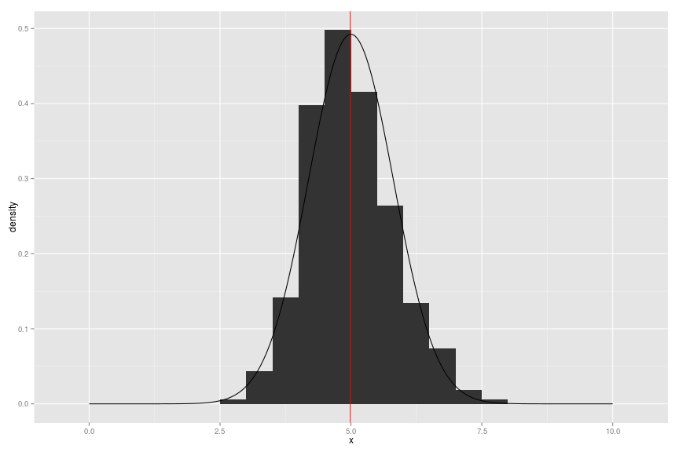

## Overview


```r
library(dplyr)
library(ggplot2)
set.seed(314159)
lambda=0.2
```

## Simulations 

I make use of the sapply function to return average of a 40 element
exponential function for every element in a list of length 1000.


```r
sims <- sapply(1:1000,function(x){ mean(rexp(40,lambda)) } )
```

This creates a 1000 element list in the variable sims.

### Sample mean versus Theoretical mean


```r
mean_sims <- mean(sims)
mean_sims
```

```
## [1] 4.98902
```

The expected mean for an exponential distribution would be $\frac{1}{\lambda}$ which equals

$$
\begin{aligned}
E[X] & = & \frac{1}{\lambda} & \newline
     & = & \frac{1}{0.2} & \newline
E[X] & = & 5
\end{aligned}
$$

#### t-Test of this mean value

In order to determine how close this sample mean $\mu$ = 
``4.989`` 
is to our ideal value of 5, I will run a t-test.  I will
be testing the null hypothesis that the average of these 1000 
averages of sets of 40 exponential random variables is equivalent to
5.  


```r
ggplot(data.frame(x=sims),aes(x=x)) + geom_histogram(aes(y=..density..),binwidth=0.5) + 
geom_vline(xintercept=mean(sims),colour="red") + 
geom_line(data=(seq(0,10,0.001) %>% data.frame(x=.,y=dnorm(x=.,mean=5,sd=sqrt(var(sims))))),aes(x=x,y=y))
```

 
Our plot clearly shows a normal shaped plot centered around the red line represnting the theoretical mean
of the distribution.

I set up the t-test as $H_0 :  \mu= 5$

P value for this is 

```r
tt <- t.test(sims,mu=5)
tt$p.value
```

```
## [1] 0.6684281
```
Since this value is greater than  $\alpha$(0.05), then we can accept our NULL hypothesis that our sample mean
matches the theoretical.

### Sample variance vs. Theoretical Variance

```r
sd_sims <- sd(sims)
sd_sims
```

```
## [1] 0.8104647
```
The expected standard deviation for an exponential random variable would be 
$$ 
\begin{aligned}
\frac{1}{\lambda}
\end{aligned}
$$

We would get $\frac{1}{(0.2)^2} / sqrt(40))$ = 0.79.

As we can see , both of these values ( variance and mean ) are very
close to their expected values and the graph shows a distribution that is very 
close to a normal distribution.

The skewness of this distribution tends to favor a fatter tail going to
positive $\infty$. This makes sense since the exponential distribution is limited 
at x = 0  and cannot contribute anymore mass in range $x : \left( -\infty, 0 \right]$.


